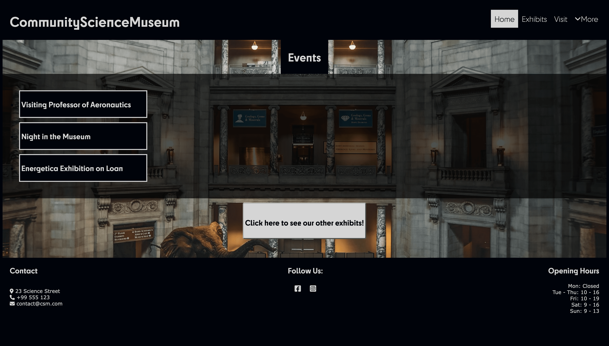

# Museum website

A very bare-bones and early project in my studies to practice CSS. Not many animations, and bugs o'plenty.

## Description

The style of the page was an attempt at a technological museum aimed at young adults/children.

Also my first attempt at having a hover function that displays a container before learning about javascript.

## Contact

[My LinkedIn page](https://www.linkedin.com/in/yngve-nykås-363b28bb/)
